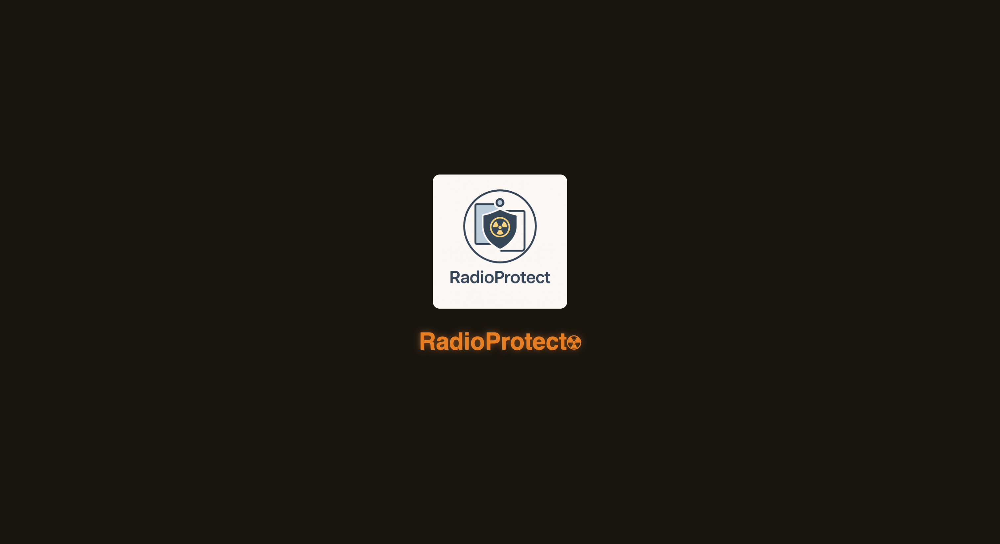
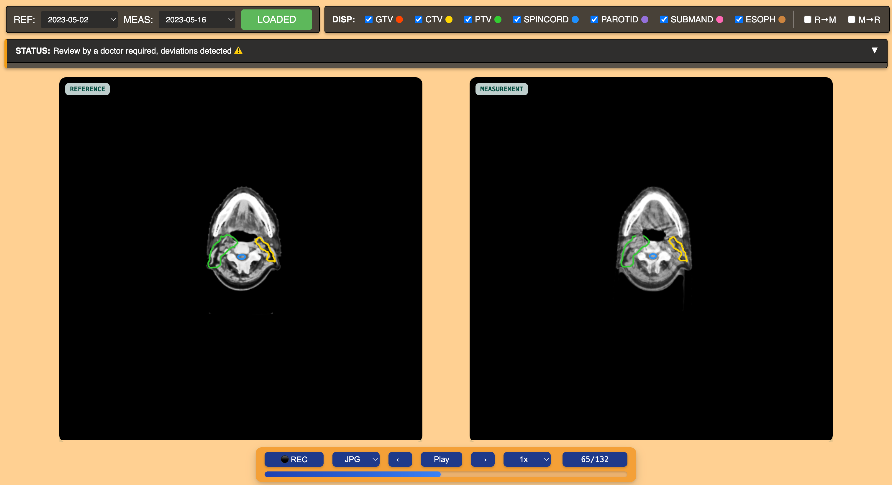
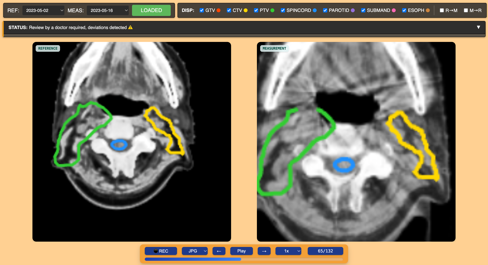
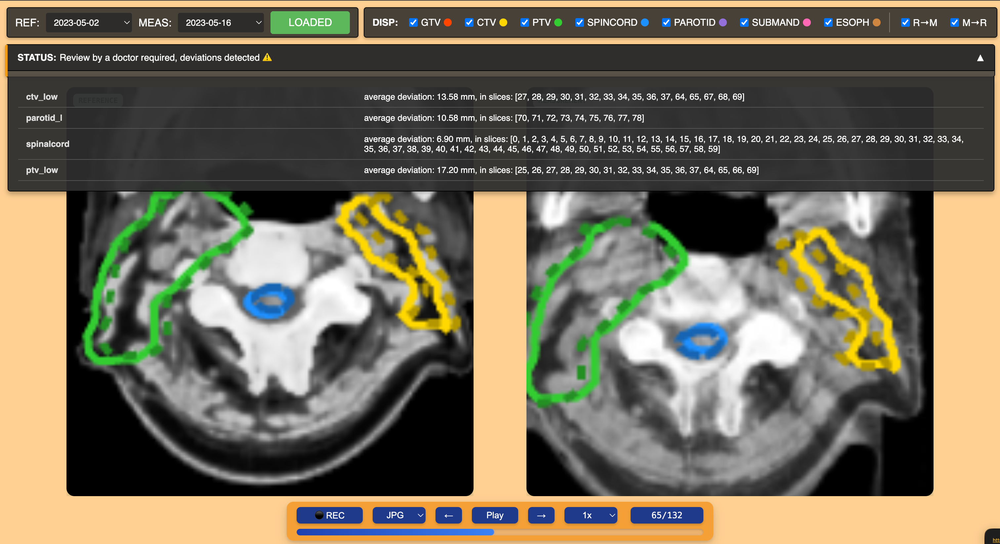
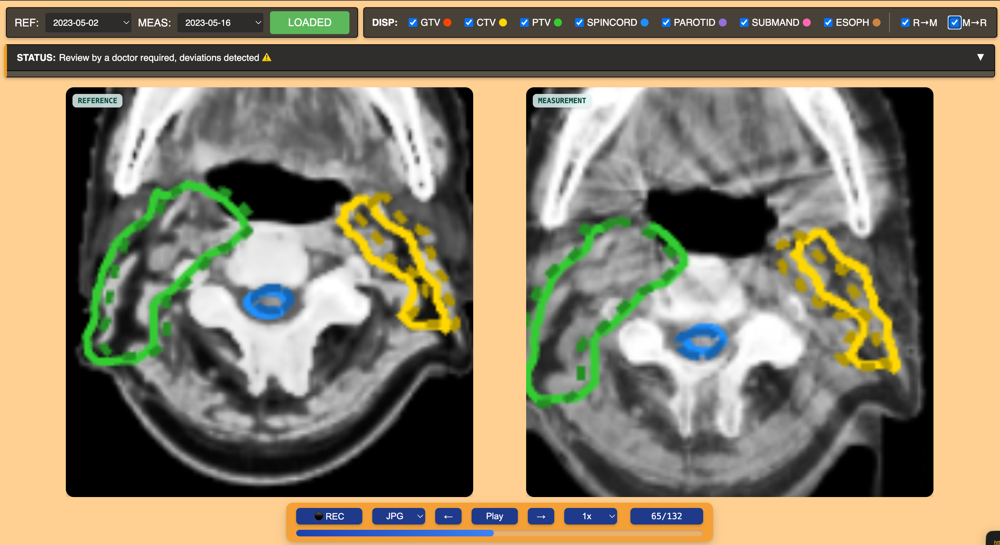

# Pixel Predators @ Rakathon 2025

## RadioProtect ☢️

This repo hosts the app we developed during the 2025 Rakathon.

The basic idea is to allow accurate registration and sampling between large reference CT scans and smaller but higher-resolution treatment-time scans recovered from the conical beam scanner.

How?

1. Interpret each CT scan as a 3D signal with given intensities
2. Use 3-Dimensional FFT (see file `pointcloud_alignment/fourier.py`) to estimate the 3D translation vector between these pointclouds
3. Align them into same-sized, equally-spaced grid volumes
4. Perform local SGD-based optimization to align complex shapes inside of the CT scan structures.

A crude visualizer written in pure JS is available.

If you want to try it out, you can do:

`uv install . && python app.py --sample SAMPLE_001`

Assuming you have the dataset. The dataset can be preprocessed using the script

`dicom_processing/organize_ct_by_date_frame.py`.

Some screenshots:

